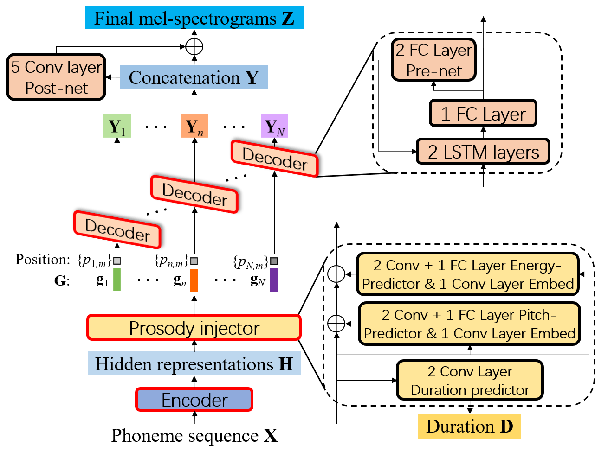

## FCL-Taco2: Towards Fast, Controllable and Lightweight Text-to-Speech synthesis (ICASSP 2021)  [Paper](http://www1.se.cuhk.edu.hk/~hccl/publications/pub/ICASSP2021-FCL-taco2-final-version.pdf) | [Demo](https://wendison.github.io/FCL-taco2-demo/)

<p align="center">
	
</p>
<p align="center">
Block diagram of FCL-taco2, where the decoder generates mel-spectrograms in AR mode within each phoneme and is shared for all phonemes.
</p>

## :speech_balloon: Huawei Noah's Ark Lab is recruiting interns on speech processing fields, if you're interested, you're welcome to contact Dr. Deng:  dengliqun.deng@huawei.com

## Training and inference scripts for FCL-taco2
## Environment
*  python 3.6.10
*  torch 1.3.1
*  chainer 6.0.0
*  espnet 8.0.0
*  apex 0.1
*  numpy 1.19.1
*  kaldiio 2.15.1
*  librosa 0.8.0

## Training and inference:

*  Step1. Data preparation & preprocessing

1.  Download LJSpeech from https://keithito.com/LJ-Speech-Dataset/

2.  Unpack downloaded LJSpeech-1.1.tar.bz2 to /xx/LJSpeech-1.1

3.  Obtain the forced alignment information by using Montreal forced aligner tool https://montreal-forced-aligner.readthedocs.io/en/latest/. Or you can download our alignment results at https://drive.google.com/file/d/1nMjPlPDtspPxgG5AK-AdBq1ce330YMGP, then unpack it to /xx/TextGrid

4.  Preprocess the dataset to extract mel-spectrograms, phoneme duration, pitch, energy and phoneme sequence by:

         python preprocessing.py --data-root /xx/LJSpeech-1.1 --textgrid-root /xx/TextGrid


*  Step2. Model training

1.  Training teacher model FCL-taco2-T: 

         ./teacher_model_training.sh

2.  Training student model FCL-taco2-S: 

         ./student_model_training.sh

3.  Parallel-WaveGAN vocoder training: follow instructions at https://github.com/kan-bayashi/ParallelWaveGAN. You can also download the pre-trained PWG vocoder, and put the PWG model under the directory "vocoder".


*  Step3. Model evaluation

1.  FCL-taco2-T evaluation: 

         ./inference_teacher.sh

2.  FCL-taco2-S evaluation: 

         ./inference_student.sh


# Citation
If you find this repository helpful for you, please cite our paper:
```
@inproceedings{wang2021fcl,
  title={Fcl-Taco2: Towards Fast, Controllable and Lightweight Text-to-Speech Synthesis},
  author={Wang, Disong and Deng, Liqun and Zhang, Yang and Zheng, Nianzu and Yeung, Yu Ting and Chen, Xiao and Liu, Xunying and Meng, Helen},
  booktitle={ICASSP 2021-2021 IEEE International Conference on Acoustics, Speech and Signal Processing (ICASSP)},
  pages={5714--5718},
  year={2021},
  organization={IEEE}
}
```
